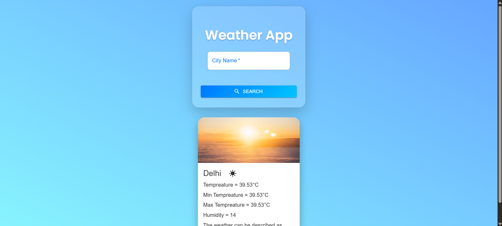
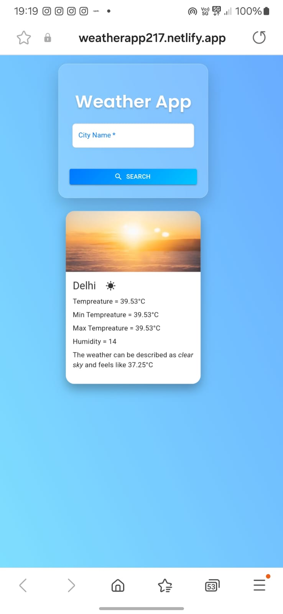

# ☀️ Weather App

A responsive and modern weather app built with **React** and **Material UI** that allows users to search for cities and view real-time weather information using the **OpenWeatherMap API**.

---

## 🚀 Features

- 🔍 Autocomplete search with live suggestions
- 🌤️ Dynamic weather info based on the selected city
- 🧊 Displays temperature, min/max temp, humidity & conditions
- 🎨 Elegant UI with intersecting layout and glassmorphism design
- 📱 Fully mobile responsive
- ⚡ Built with Vite for lightning-fast performance

---

## 🌐 Live Demo

🔗 [Click here to view the deployed app](https://your-netlify-link.netlify.app)

---

## 📦 Tech Stack

- **React** (with hooks)
- **Material UI (MUI)** components
- **OpenWeatherMap API**
- **Vite** (as the build tool)
- **Netlify** (for deployment)

---

## 🛠️ How to Run Locally

1. Clone the repository  
```bash
git clone https://github.com/JhanvibaZala/Weather-App.git
cd Weather-App
````

2. Install dependencies

```bash
npm install
```

3. Create a `.env` file and add your OpenWeather API key:

```bash
VITE_WEATHER_API_KEY=your_api_key_here
```

4. Start the server

```bash
npm run dev
```

---

## 🧠 API Used

* [OpenWeatherMap API](https://openweathermap.org/api)
* [Geo Direct API](https://openweathermap.org/api/geocoding-api) for location suggestions

---

## 📷 Screenshots

| Desktop View                        | Mobile View                       |
| ----------------------------------- | --------------------------------- |
|  |  |

---

## 💡 Future Improvements

* Add dark/light theme toggle 🌗
* Include weather icons and animations ⛅
* Save recent searches in local storage
* Display current time and sunrise/sunset

---

## 🙋‍♀️ Author

Developed by [Jhanvi Zala](https://github.com/JhanvibaZala)
